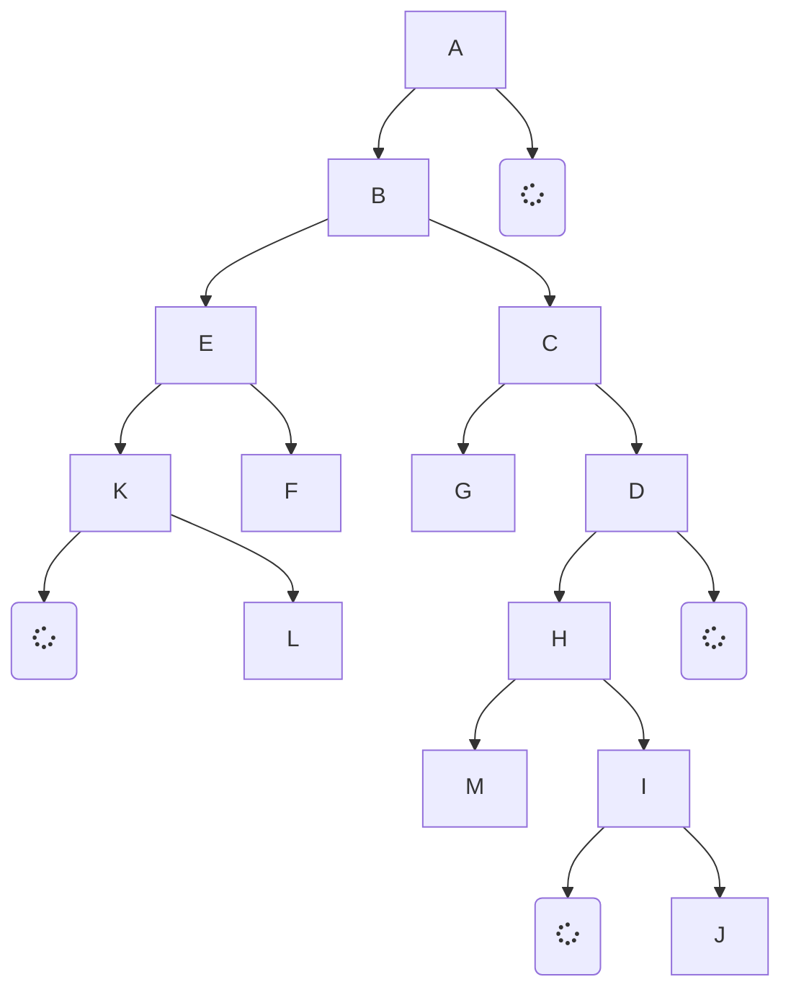
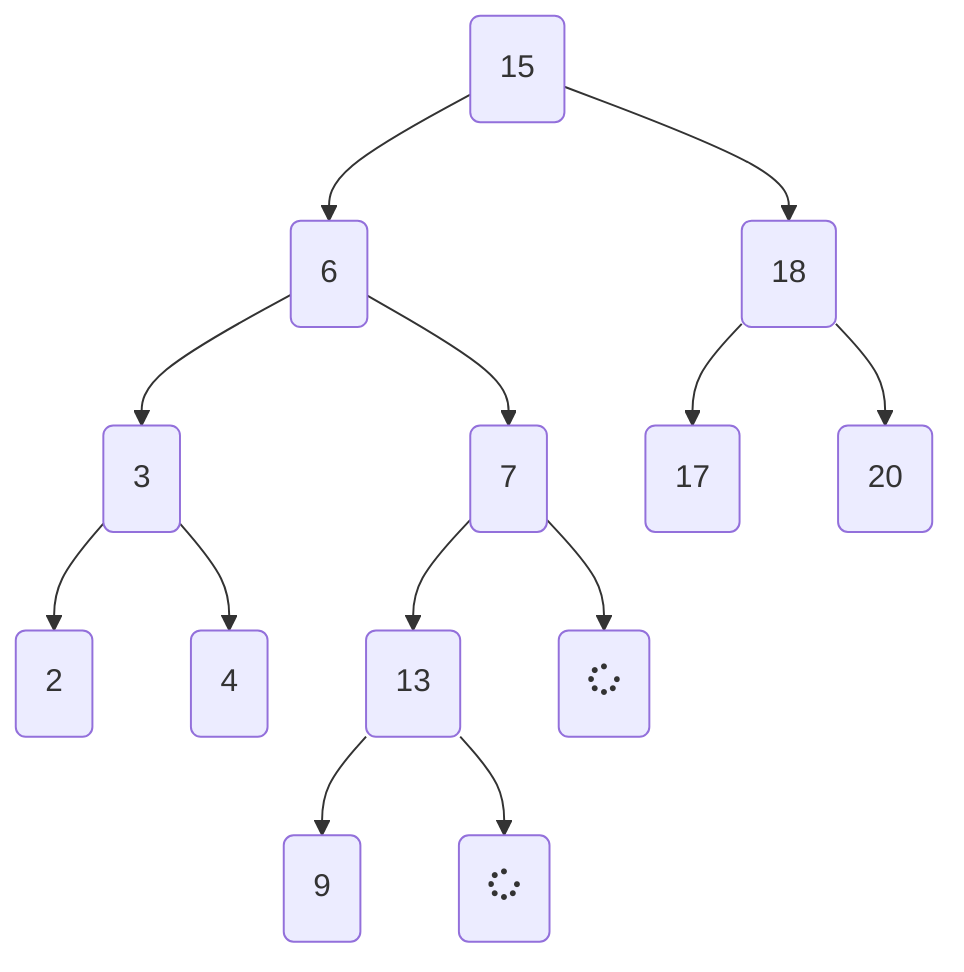

### Programming, and Data Structures

#### Workbook 6 | Binary Search Trees

This worksheet WILL be graded. Be sure to use the Class template design provided in Average.java from Workbook0.

Today’s lab is about searching for data in linear data structures. We are going to implement what we saw in the lecture notes. For each part, create an array of integer data yourselves. For Part3.java, make sure that your array is already sorted (remember, Binary Search only works on sorted data).

Before you begin.

- Ensure that your workspace is in a folder which is backed up to the web/ network e.g. college network drive, google drive. You may like to have it in the following folder structure …/GriffithCollege/PDS/workspace
- Load Eclipse selecting the appropriate workspace
- Make a new java project called Workbook03
- Make a new package in this project called workbook03
- Make a 3 new java files with the name provided below.

> COMMENT YOUR CODE!!!!!!! SERIOUSLY. I CANNOT GIVE MARKS IF YOU DON’T
> EXPLAIN WHAT YOU ARE DOING.

> Use an application like draw.io for your diagrams. Handwritten  
> submissions will not be accepted.

---

Tasks

1. Perform a postorder, preorder & inorder traversal of the binary tree.

2. For part e and f there are two child nodes.

     - a) Fix the tree above to ensure it is an actual Binary Search Tree and use this new tree to answers the questions below
     - b) Perform a postorder, preorder & inorder traversal of the above binary search tree.
     - c) Insert the value 12 into the above BST (please redraw the entire tree)
     - d) Insert the value 22 into the above BST (please redraw the entire tree)
     - e) Delete the value 6 from the above BST (please redraw the entire tree)
     - f) Delete the value 18 from the above BST (please redraw the entire tree)
     - g) Delete the value 9 from the above BST(please redraw the entire tree)
     - h) Delete the value 13 from the above BST(please redraw the entire tree)
     - i) What is the successor to value 15 in the above BST?

> For parts c) to i) ensure that you used the fixed binary search tree as the starting point for each question.
>
> Use the following algorithm:
>
> - Use the Rightmost node of the Leftside of the BST (Value to be deleted is on the left or the root).
> - Use the Leftmost node of the Rightside of the BST (Value to be deleted is on the right or the root when the left side of the tree is empty).
> - For part i Read the Extra Reading slides to find out the Successor value of a node.

3. Draw the binary search tree that is created from inserting data in the following order. Start with the root node as 1 and then insert the values by asking the question “Is it greater or less than the current node?”.
   1,12,9,18,17,19,4,5,3

> Submit your software via Moodle before the deadline. To submit, create an archive in the format
> Lastname_firstname_studentNumber_workBookNumber.zip eg Kohlmann_Stephen_123456_workkbook04.zip

